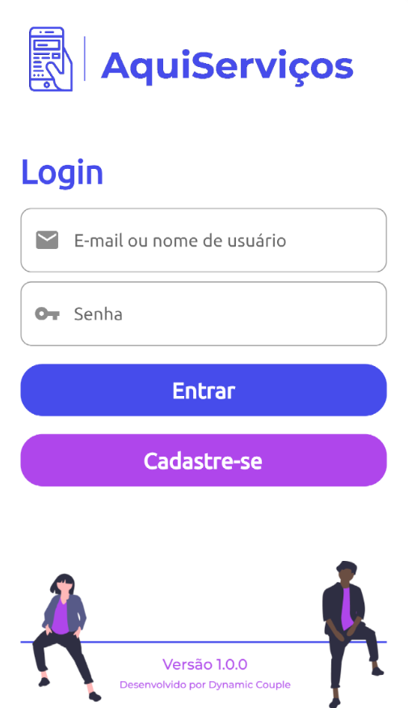

# Aqui Serviços

Hey guys. Made this repo just to improving my Flutter skills by trying to build an app.

## Table of Contents

- [Screenshots](#screenshots-camera)
- [To Do](#to-do-pushpin)
- [Notes](#notes-notebook)
- [Social Media](#social-media-bust_in_silhouette)

## Screenshots :camera:

## To Do :pushpin:

- [x] ~~Create Login Screen~~
- [x] ~~Create Home Screen~~
- [x] ~~Navigate between screens~~
- [ ] Create a "Show Password" button on Login Screen
- [ ] Use Animations
- [ ] Use FireBase to authenticate the users

* Note: this project is in progress, not finished yet

## Notes :notebook:

* Well, my intention is to start step by step, from a noob to a experient Flutter developer. I intend to implement some complex features in the future, but for now, I am just starting by prototype the app and learn the basics of the framework.

## Social Media :bust_in_silhouette:

* My name: Wesley Marques Pizetta
* E-mail: wesleypizetta@hotmail.com
* Linkedin: https://www.linkedin.com/in/wesley-pizetta-329606190/
